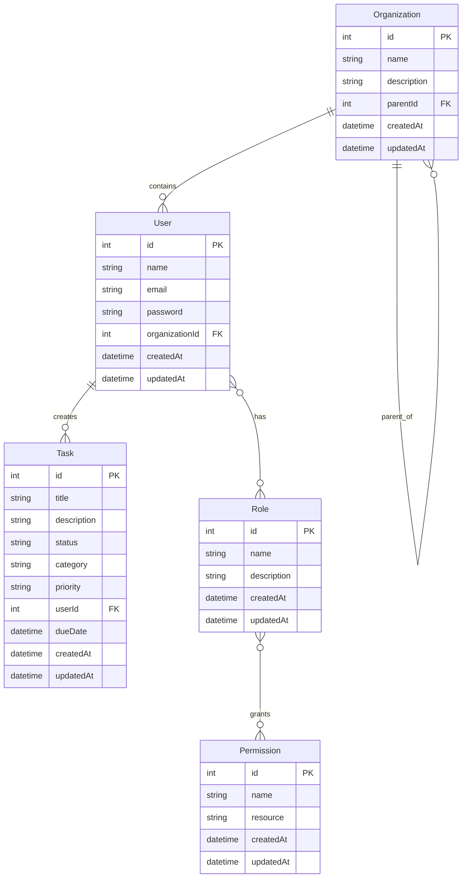

# 🚀 Secure Task Management System

A full-stack task management system built with **NestJS**, **Angular**, and **NX** featuring comprehensive **Role-Based Access Control (RBAC)**, **JWT authentication**, and **drag-and-drop** task management.

## 📌 Overview

This project demonstrates a production-ready secure task management system with:

- **🔐 Real JWT Authentication** - No mock authentication
- **👥 Role-Based Access Control (RBAC)** - Owner, Admin, Viewer roles
- **🏢 Organization Hierarchy** - 2-level organizational structure
- **📋 Task Management** - Full CRUD with drag-and-drop
- **🔍 Audit Logging** - Complete action tracking
- **🧪 Comprehensive Testing** - 33+ tests covering core functionality
- **📱 Responsive Design** - Mobile-first approach

## 🏗️ Architecture Overview

### NX Monorepo Structure

```
TurboVetsProject/
├── apps/
│   ├── api/                    # NestJS Backend
│   │   ├── src/
│   │   │   ├── auth/          # Authentication & RBAC
│   │   │   ├── tasks/         # Task management
│   │   │   ├── entities/      # TypeORM entities
│   │   │   └── database/      # Database configuration
│   │   └── dist/              # Built application
│   └── dashboard/             # Angular Frontend
│       ├── src/
│       │   ├── components/    # UI components
│       │   ├── services/      # API services
│       │   └── models/        # TypeScript interfaces
│       └── dist/              # Built application
├── packages/                  # Shared libraries
│   ├── @org/strings          # String utilities
│   ├── @org/async            # Async utilities
│   ├── @org/colors           # Color utilities
│   └── @org/utils            # Shared utilities
└── data/
    └── app.db                # SQLite database
```

### Key Design Decisions

1. **Modular Architecture**: NX monorepo enables code sharing and consistent tooling
2. **Security-First**: RBAC implemented at service layer with decorators/guards
3. **Type Safety**: Full TypeScript coverage with shared interfaces
4. **Testing Strategy**: Comprehensive backend tests, frontend component tests
5. **Database**: SQLite for development, easily configurable for production

## 🚀 Quick Start

### Prerequisites

- Node.js 18+ 
- npm or yarn
- Git

### Installation

```bash
# Clone the repository
git clone <your-repo-url>
cd TurboVetsProject

# Install dependencies
npm install

# Set up environment variables
cp .env.example .env
# Edit .env with your configuration
```

### Environment Setup

Create a `.env` file in the root directory:

```env
# JWT Configuration
JWT_SECRET=your-super-secret-jwt-key-here
JWT_EXPIRES_IN=24h

# Database Configuration
DB_TYPE=sqlite
DB_DATABASE=data/app.db

# Application Configuration
PORT=3000
NODE_ENV=development
```

### Running the Applications

```bash
# Start the backend API
npx nx serve api

# Start the frontend dashboard (in another terminal)
npx nx serve dashboard

# Or run both in parallel
npx nx run-many -t serve --projects=api,dashboard --parallel=2
```

The applications will be available at:
- **Backend API**: http://localhost:3000
- **Frontend Dashboard**: http://localhost:4200

### Database Setup

The SQLite database is automatically created and seeded with initial data:

```bash
# Seed the database with sample data
npx nx run api:seed

# Or manually run the seed script
cd apps/api
npm run seed
```

## 📊 Data Model

### Entity Relationship Diagram



### Core Entities

#### User
- **Primary Key**: `id`
- **Authentication**: `email`, `password` (bcrypt hashed)
- **Relationships**: Belongs to Organization, Has Role, Creates Tasks

#### Organization
- **Hierarchy**: 2-level structure (parent-child)
- **Scoping**: Determines data access boundaries
- **Roles**: Defines available roles within organization

#### Task
- **Status**: PENDING, IN_PROGRESS, COMPLETED, CANCELLED
- **Priority**: LOW, MEDIUM, HIGH, URGENT
- **Assignment**: Can be assigned to users within same organization

#### Role & Permissions
- **Roles**: Owner, Admin, Viewer
- **Permissions**: create_task, read_task, update_task, delete_task, etc.
- **Inheritance**: Higher roles inherit lower role permissions

## 🔐 Access Control Implementation

### RBAC Architecture

The system implements a comprehensive Role-Based Access Control system:

#### 1. **Authentication Layer**
```typescript
// JWT Strategy
@Injectable()
export class JwtStrategy extends PassportStrategy(Strategy) {
  async validate(payload: any) {
    return { userId: payload.sub, email: payload.email, roles: payload.roles };
  }
}
```

#### 2. **Authorization Decorators**
```typescript
// Permission-based access
@RequirePermissions('create_task')
@Post()
async createTask(@Body() createTaskDto: CreateTaskDto) {
  // Only users with 'create_task' permission can access
}

// Role-based access
@RequireRoles('Admin', 'Owner')
@Get('admin/stats')
async getAdminStats() {
  // Only Admin and Owner roles can access
}

// Organization scope
@OrganizationScope('own')
@Get('tasks')
async getTasks() {
  // Users can only access tasks within their organization
}
```

#### 3. **Guard Implementation**
```typescript
@Injectable()
export class PermissionsGuard implements CanActivate {
  async canActivate(context: ExecutionContext): Promise<boolean> {
    const requiredPermissions = this.reflector.getAllAndOverride<string[]>(
      PERMISSIONS_KEY, [context.getHandler(), context.getClass()]
    );
    
    // Check user permissions against required permissions
    const hasPermission = await this.rbacService.hasPermission(
      user.id, permission
    );
    
    return hasPermission;
  }
}
```

### Permission Matrix

| Role    | Create Task | Read Task | Update Task | Delete Task | Admin Access |
|---------|-------------|-----------|-------------|-------------|--------------|
| Owner   | ✅          | ✅         | ✅          | ✅          | ✅           |
| Admin   | ✅          | ✅         | ✅          | ✅          | ✅           |
| Viewer  | ❌          | ✅         | ❌          | ❌          | ❌           |

### Organization Scoping

- **`own`**: Access only within user's organization
- **`sub`**: Access within user's organization and sub-organizations
- **`all`**: Access across all organizations (Owner/Admin only)

## 🛠️ API Documentation

### Authentication Endpoints

#### POST /auth/login
Authenticate user and receive JWT token.

**Request:**
```json
{
  "email": "user@example.com",
  "password": "password123"
}
```

**Response:**
```json
{
  "access_token": "eyJhbGciOiJIUzI1NiIsInR5cCI6IkpXVCJ9...",
  "user": {
    "id": 1,
    "name": "John Doe",
    "email": "user@example.com",
    "roles": ["Admin"]
  }
}
```

### Task Management Endpoints

#### GET /tasks
Retrieve tasks based on user's permissions and organization scope.

**Headers:**
```
Authorization: Bearer <jwt-token>
```

**Query Parameters:**
- `status`: Filter by task status (pending, in_progress, completed, cancelled)
- `assigneeId`: Filter by assignee ID
- `organizationId`: Filter by organization ID

**Response:**
```json
[
  {
    "id": 1,
    "title": "Complete project documentation",
    "description": "Write comprehensive README",
    "status": "in_progress",
    "priority": "high",
    "assigneeId": 2,
    "dueDate": "2024-12-31T23:59:59.000Z",
    "createdAt": "2024-01-01T00:00:00.000Z",
    "updatedAt": "2024-01-01T12:00:00.000Z"
  }
]
```

#### POST /tasks
Create a new task.

**Request:**
```json
{
  "title": "New Task",
  "description": "Task description",
  "priority": "medium",
  "assigneeId": 2,
  "dueDate": "2024-12-31T23:59:59.000Z"
}
```

**Response:**
```json
{
  "id": 3,
  "title": "New Task",
  "description": "Task description",
  "status": "pending",
  "priority": "medium",
  "assigneeId": 2,
  "dueDate": "2024-12-31T23:59:59.000Z",
  "createdAt": "2024-01-01T00:00:00.000Z",
  "updatedAt": "2024-01-01T00:00:00.000Z"
}
```

#### PUT /tasks/:id
Update an existing task.

**Request:**
```json
{
  "title": "Updated Task Title",
  "status": "in_progress",
  "priority": "high"
}
```

#### DELETE /tasks/:id
Delete a task.

**Response:**
```
HTTP 204 No Content
```

#### GET /tasks/assignable-users
Get list of users that can be assigned tasks.

**Response:**
```json
[
  {
    "id": 1,
    "name": "John Doe",
    "email": "john@example.com",
    "organization": {
      "id": 1,
      "name": "Acme Corp"
    }
  }
]
```

### Admin Endpoints

#### GET /tasks/admin/stats
Get organization statistics (Admin/Owner only).

**Response:**
```json
{
  "totalTasks": 150,
  "ownOrgTasks": 100,
  "subOrgTasks": 50,
  "hierarchy": {
    "id": 1,
    "name": "Acme Corp",
    "children": [
      {
        "id": 2,
        "name": "Engineering Team"
      }
    ]
  }
}
```

#### GET /audit-logs
Retrieve audit logs (Admin/Owner only).

**Response:**
```json
[
  {
    "timestamp": "2024-01-01T12:00:00.000Z",
    "userId": 1,
    "action": "create_task",
    "resource": "tasks",
    "status": "success",
    "details": {"taskId": 123},
    "ipAddress": "192.168.1.1",
    "userAgent": "Mozilla/5.0..."
  }
]
```

## 🧪 Testing

### Backend Tests

The backend includes comprehensive test coverage:

```bash
# Run all backend tests
npx nx test api

# Run specific test suites
npx nx test api --testPathPattern=tasks
npx nx test api --testPathPattern=auth
```

**Test Coverage:**
- ✅ **Tasks Service** - CRUD operations, business logic
- ✅ **Tasks Controller** - API endpoints, request handling
- ✅ **JWT Auth Guard** - Authentication security
- ✅ **Audit Service** - Logging functionality
- ✅ **App Service/Controller** - Basic functionality

**Total: 33 tests passing**

### Frontend Tests

```bash
# Run frontend tests
npx nx test dashboard
```

### Test Examples

```typescript
// Example: Task Service Test
describe('TasksService', () => {
  it('should create a new task', async () => {
    const createTaskDto = {
      title: 'Test Task',
      description: 'Test Description',
      userId: 1
    };
    
    const result = await service.create(createTaskDto);
    
    expect(result.title).toBe('Test Task');
    expect(result.userId).toBe(1);
  });
});
```

## 🎨 Frontend Features

### Task Management Dashboard

- **📋 Kanban Board** - Drag-and-drop task management
- **🔍 Advanced Filtering** - Filter by status, priority, assignee
- **👥 User Assignment** - Dropdown selection for task assignment
- **📊 Task Statistics** - Visual progress indicators
- **📱 Responsive Design** - Mobile-first approach

### Key Components

#### Task Component
- **Drag & Drop**: Move tasks between status columns
- **Real-time Updates**: Immediate UI feedback
- **Form Validation**: Client-side validation with error handling
- **User Assignment**: Dynamic user selection

#### Authentication
- **JWT Integration**: Automatic token management
- **Route Guards**: Protected routes based on authentication
- **Role-based UI**: Different interfaces for different roles

## 🚀 Development Commands

```bash
# Development
npx nx serve api                    # Start backend
npx nx serve dashboard              # Start frontend
npx nx run-many -t serve --parallel=2  # Start both

# Building
npx nx build api                    # Build backend
npx nx build dashboard              # Build frontend
npx nx run-many -t build            # Build all

# Testing
npx nx test api                     # Test backend
npx nx test dashboard               # Test frontend
npx nx run-many -t test             # Test all

# Linting
npx nx lint api                     # Lint backend
npx nx lint dashboard               # Lint frontend
npx nx run-many -t lint             # Lint all

# Database
npx nx run api:seed                 # Seed database
npx nx run api:reset                # Reset database

# Utilities
npx nx graph                        # View project graph
npx nx show project api             # Show project details
npx nx affected -t test             # Test affected projects
```

## 🔧 Configuration

### Backend Configuration

**Database (TypeORM):**
```typescript
// apps/api/src/database/database.config.ts
export const databaseConfig: TypeOrmModuleOptions = {
  type: 'sqlite',
  database: 'data/app.db',
  entities: [User, Organization, Role, Permission, Task],
  synchronize: true, // Only for development
  logging: false
};
```

**JWT Configuration:**
```typescript
// apps/api/src/auth/auth.module.ts
JwtModule.register({
  secret: process.env.JWT_SECRET,
  signOptions: { expiresIn: process.env.JWT_EXPIRES_IN || '24h' }
})
```

### Frontend Configuration

**API Configuration:**
```typescript
// apps/dashboard/src/app/services/task.service.ts
private readonly API_URL = 'http://localhost:3000/api';
```

**Angular Configuration:**
```typescript
// apps/dashboard/src/app/app.config.ts
export const appConfig: ApplicationConfig = {
  providers: [
    provideHttpClient(),
    provideRouter(routes),
    // ... other providers
  ]
};
```

## 🚀 Deployment

### Production Build

```bash
# Build for production
npx nx build api --configuration=production
npx nx build dashboard --configuration=production

# The built applications will be in:
# - apps/api/dist/
# - apps/dashboard/dist/dashboard/
```

### Environment Variables

Create production environment files:

**Backend (.env.production):**
```env
JWT_SECRET=your-production-secret-key
JWT_EXPIRES_IN=1h
DB_TYPE=postgres
DB_HOST=your-db-host
DB_PORT=5432
DB_USERNAME=your-username
DB_PASSWORD=your-password
DB_DATABASE=task_management
NODE_ENV=production
PORT=3000
```

**Frontend (environment.prod.ts):**
```typescript
export const environment = {
  production: true,
  apiUrl: 'https://your-api-domain.com/api'
};
```

## 🔮 Future Considerations

### Advanced Features

1. **Advanced Role Delegation**
   - Temporary role assignments
   - Role inheritance chains
   - Custom permission sets

2. **Production-Ready Security**
   - JWT refresh tokens
   - CSRF protection
   - Rate limiting
   - RBAC caching

3. **Scaling Permission Checks**
   - Redis caching for permissions
   - Database query optimization
   - Microservice architecture

4. **Enhanced UI/UX**
   - Real-time notifications
   - Advanced task filtering
   - Bulk operations
   - Keyboard shortcuts

5. **Monitoring & Analytics**
   - Performance metrics
   - User activity tracking
   - System health monitoring

### Technical Improvements

1. **Database Migration**
   - PostgreSQL for production
   - Database migrations
   - Connection pooling

2. **Caching Strategy**
   - Redis for session management
   - Query result caching
   - CDN for static assets

3. **API Enhancements**
   - GraphQL support
   - WebSocket for real-time updates
   - API versioning

## 🤝 Contributing

1. Fork the repository
2. Create a feature branch (`git checkout -b feature/amazing-feature`)
3. Commit your changes (`git commit -m 'Add amazing feature'`)
4. Push to the branch (`git push origin feature/amazing-feature`)
5. Open a Pull Request

## 📄 License

This project is licensed under the MIT License - see the [LICENSE](LICENSE) file for details.

## 🙏 Acknowledgments

- **NestJS** - Progressive Node.js framework
- **Angular** - Modern web framework
- **NX** - Smart monorepo build system
- **TypeORM** - Object-relational mapping
- **Angular CDK** - Drag and drop functionality

---

**Built with ❤️ using NX, NestJS, and Angular**