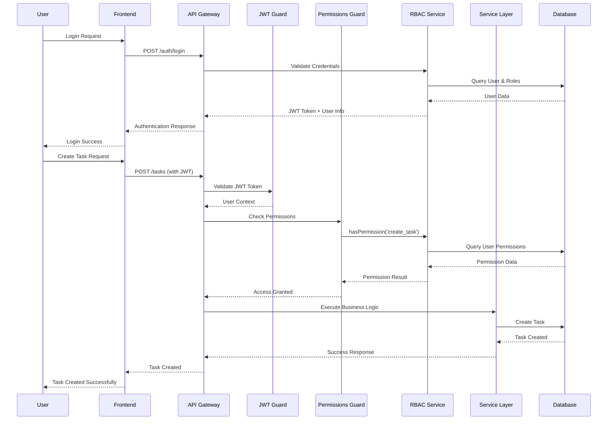

# System Architecture Diagrams

## High-Level System Architecture

## RBAC Permission Flow

## Data Model Relationships

## Task Management Flow

## Security Architecture

## Deployment Architecture

